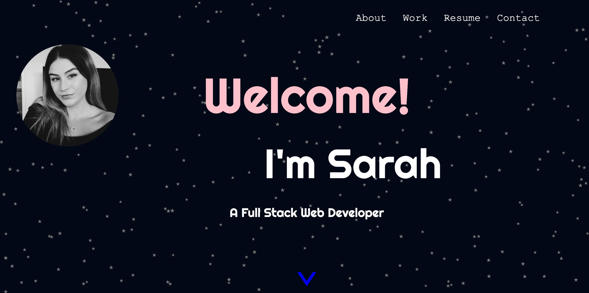
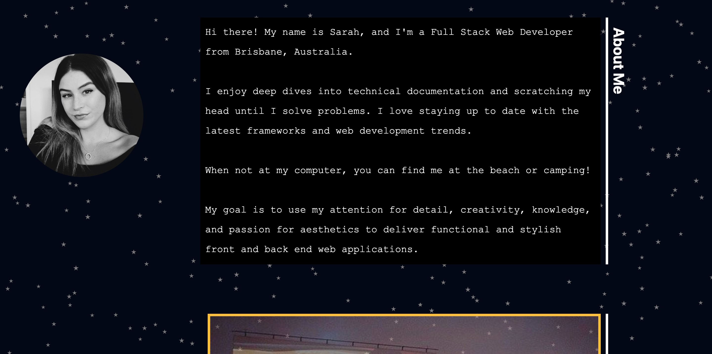
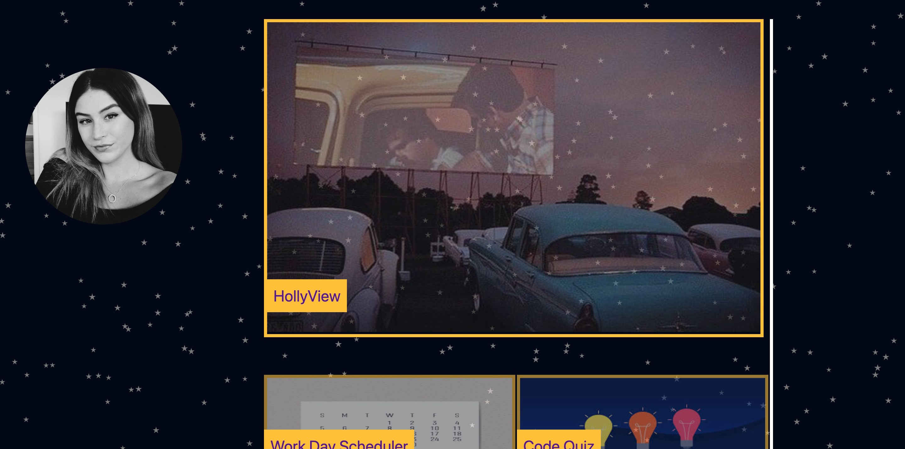
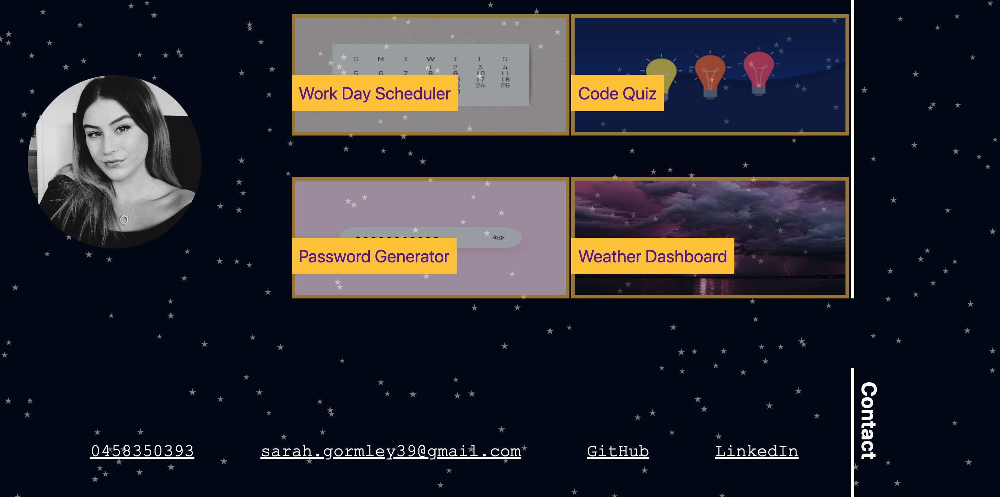

# Portfolio-SarahGormley

[Website live URL](https://sarahgormley.github.io/Portfolio-SarahGormley/)

## Table Of Contents
* [Description](#description)
* [Credits](#credits)
* [License](#license)
* [Contributions](#contributions)
* [Questions](#questionscontact)
* [Website Screenshots](#screenshots)

## Description
This portfolio was created as a way to showcase my skills in using HTML, CSS, and Javascript  to create a stylish and functional webpage containing information about myself, my work as a web developer, and links to my contact information. This webapge contains information about me, a showcase of my current portfolio, and links for potential employers to contact me. 

To create this page, I used HTML, CSS, and Javascript to create and design the webpage. I used particles.JS to create a space-themed background. I designed the page layout to resemble a social media profile as my design choice. I added a smooth scroll for an aesthetic effect. I added my name and profile photo to the side of the page and then positioned my page content to sit next to this. When the user clicks on my profile, they are redirected to the top of the page.

To ensure this webpage meets accessibility requirements, I have added alt tags to each image, commented on each CSS element, and ensured the CSS file follows the same structure as the HTML. 

## Credits
Sarah Gormley

## License
This repository is licenced under Apache.

## Contributions
To contribute to this project, please Email me :) See below.

## Questions/Contact
For questions and comments related to this repository, please email me at: sarah.gormley39@gmail.com. Alternatively, view my other projects at [sarahgormley](https://github.com/sarahgormley).

## Screenshots:

